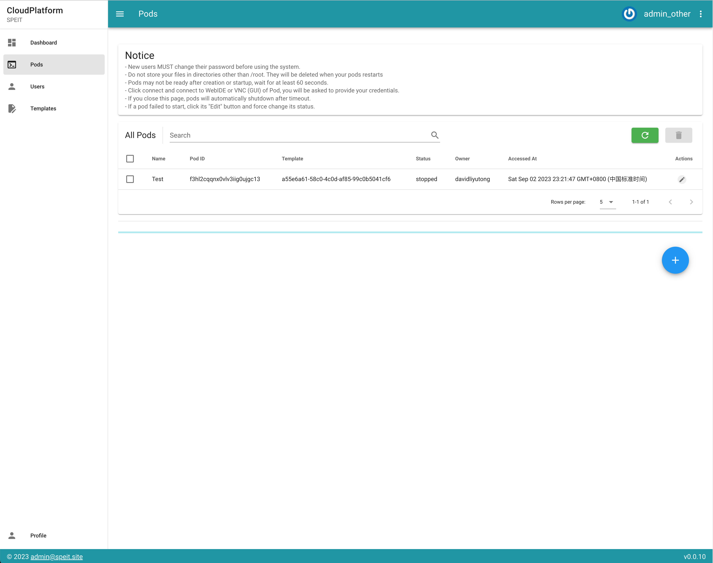
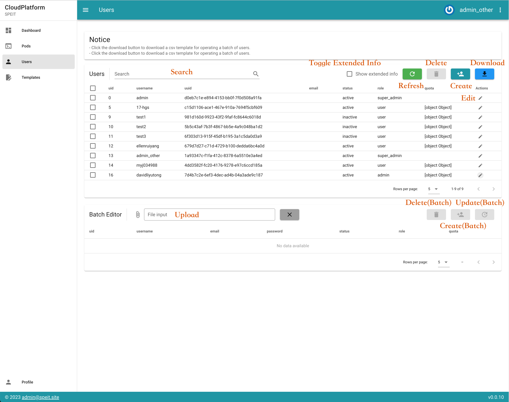
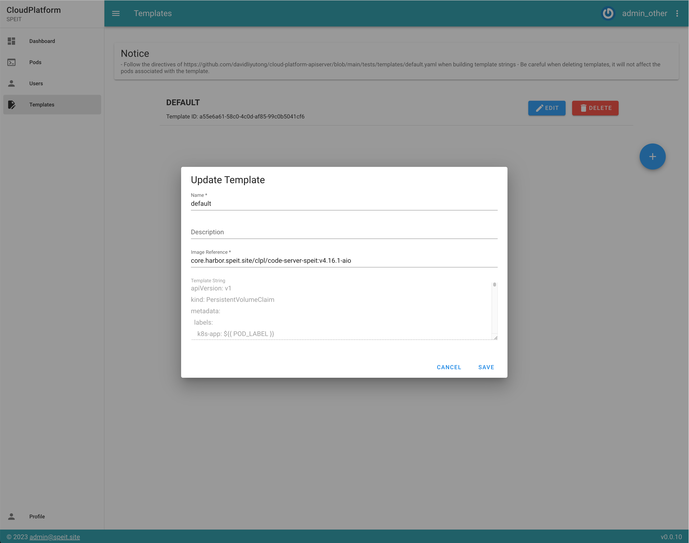

# Cloud Platform Admin Manual

> As system admin, your will be granted with not only more priviledges, but also more responsibilites.

## Intro

There are two types of administrator: `admin` and `super_admin`. `super_admin` cannot be deleted.

## Dashboard

Admins can view dashboard and check the apiserver version. In the near future, `super_admin` will be able to clear faults, reboot instance, or reset instance on this page.

## Pods

Admins can see all pods and modify them.

> Attention: admins can set whatever timeout they want
>
> 

## Users

`admin` and `super_admin` can see all users, modify their profiles.

### CSV Download and Batch Edit

Click the Download button to download a csv formated user infomation. If no user is selected, an empty datasheet will be generated.

Admins can edit the datasheet locally and upload it to the Batch Editor. They can then choose to delete, create or update user database with this edited csv.

> Attention: super_admin users cannot be deleted.

> Attention: admins cannot delete themselves.

> Attention: admins can force set password for other users.

> Attention: currently, to set user's quota, every field should be specified.

## Templates

Admins can create / update / delete templates. A valid template contains a reference to docker image and a template string.

The docker image should expose several port:

- `3000` for WebIDE
- `80` for VNC
- `2222` for SSH

The template string should contain following symbols:

- `POD_LABEL`: label of pod
- `POD_ID`: pod.pod_id,
- `POD_CPU_LIM`: e.g. "2000m",
- `POD_MEM_LIM`: e.g. "4096Mi",
- `POD_STORAGE_LIM`: e.g. "10Mi",
- `POD_REPLICAS`: e.g. "1",
- `TEMPLATE_IMAGE_REF`: e.g. "davidliyutong/code-server-speit:latest"

> Attention: during pod creation, pod will render the template and cache the result in its pod.template_str attribute. If the template is deleted, pods will use its cached template.
