# Cloud Platform User Manual

## Login

Navigate to your deployment website: https://host.example.com/ and enter the account and password to log in. If OIDC login is configured, click the OIDC button.

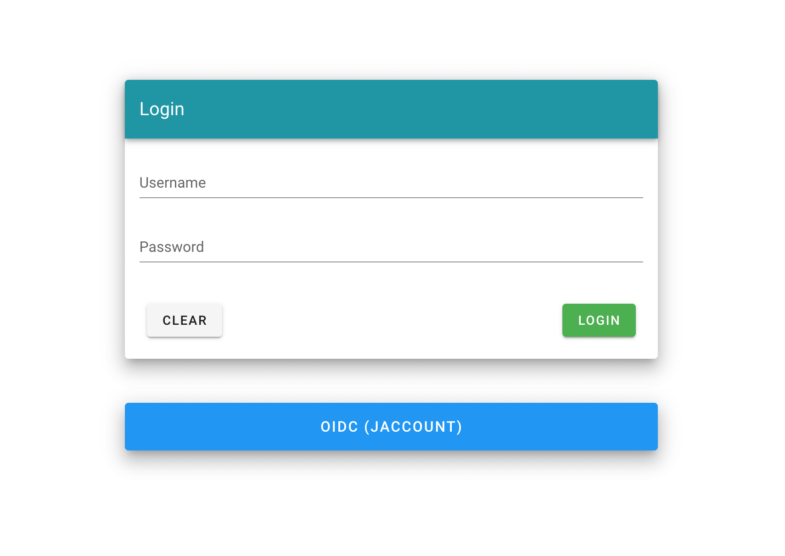

## Pod Management

Here is a short explanation of functions

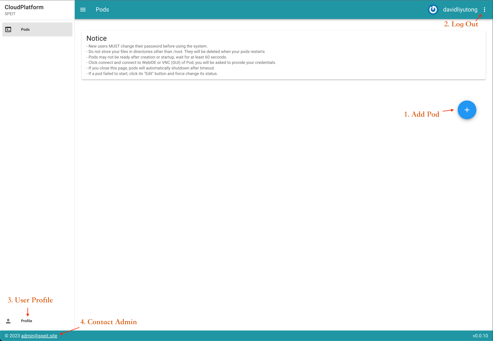

1. Add Pod
2. Click to log out
3. Navigate to Profile Management
4. Contact admin by email

### Pod Creation

When the add pod button is clicked, the interface “Create Pod” will be displayed, fill in the required fields (default values or set by users) and then click the Save button.

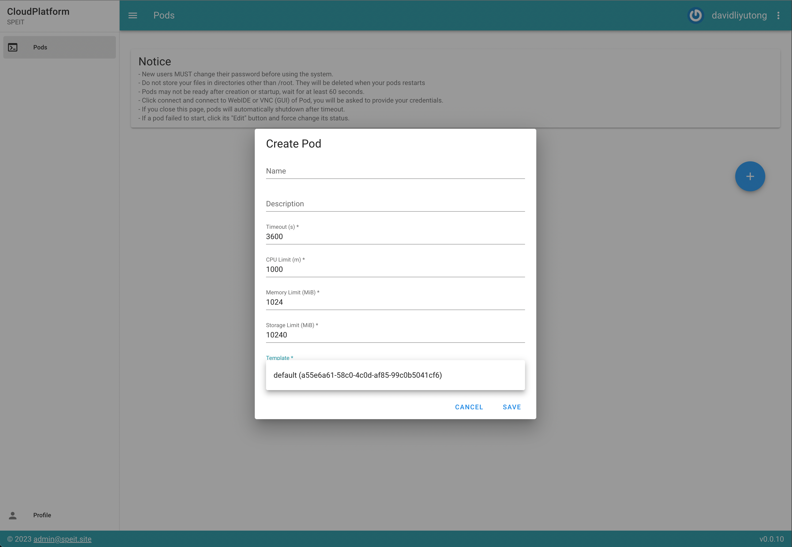

   - **Name**: Enter the name of the pod.
   - **Description**: Some description of the pod.
   - **Template**: usually the default template would do just fine.
   - **Timeout**: The amount of time the program can continue to run after the user closes the page or disconnects;
   - **CPU Limit**: CPU performance limitations 1000 = 1CPU core
   - **Memory Limit**: The memory space required by the program, in MB;
   - **Storage Limit**: The storage space required by the program, must be greater than 10G;

   > Attention: All required fields need to be filled in, otherwise the save operation will fail.

After creation, refreshes are requried to load the new pod information
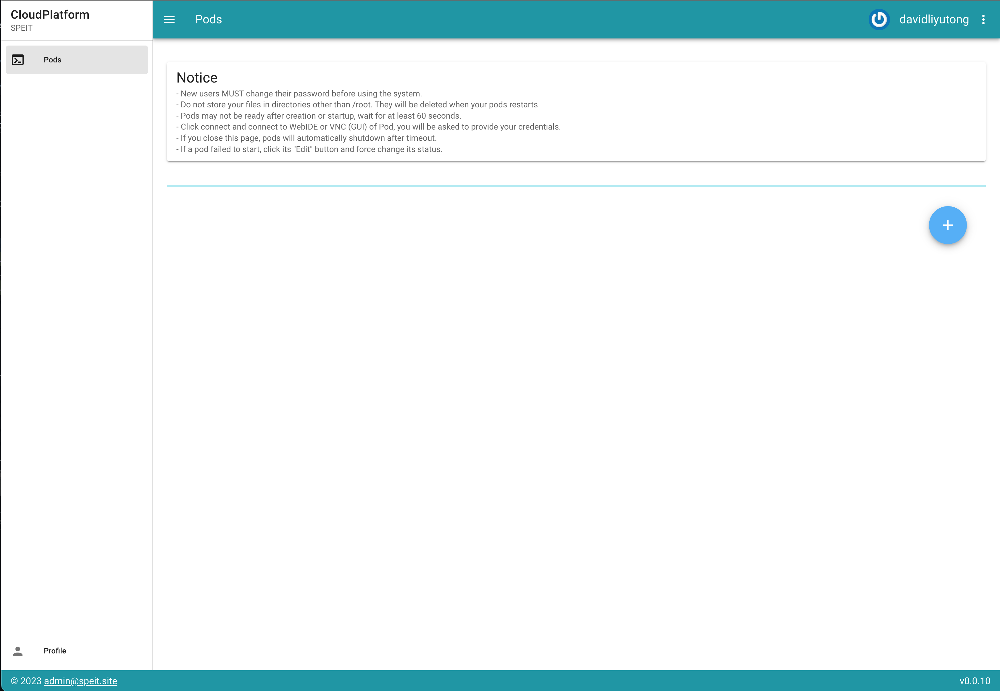

In case the pod's **CONNECT** button stuck in disabled for long time, click the **EDIT** button and set its status to "running" to force start it
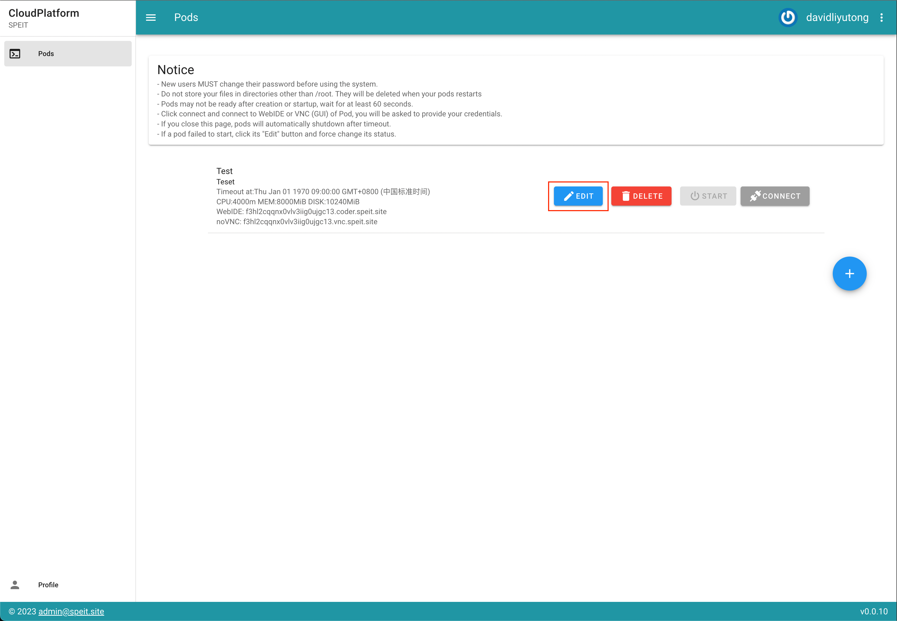
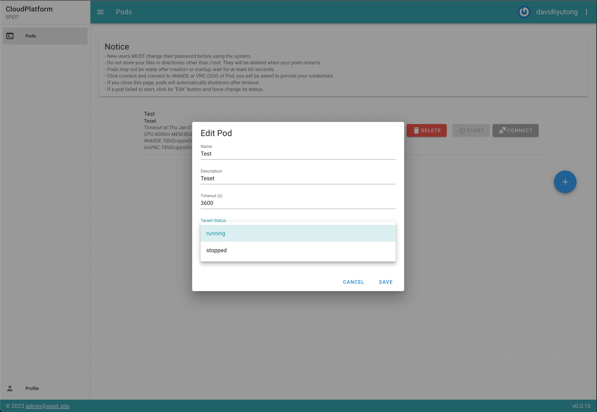

### Pod Power

Click the **START**/**STOP** button to turn the Pod ON/OFF.

### Pod Connection

By clicking **CONNECT**, users can choose to connect to WEBIDE or VNC in the drop-down menu. Users will be redirected to new page, the page is automatically authenticated.

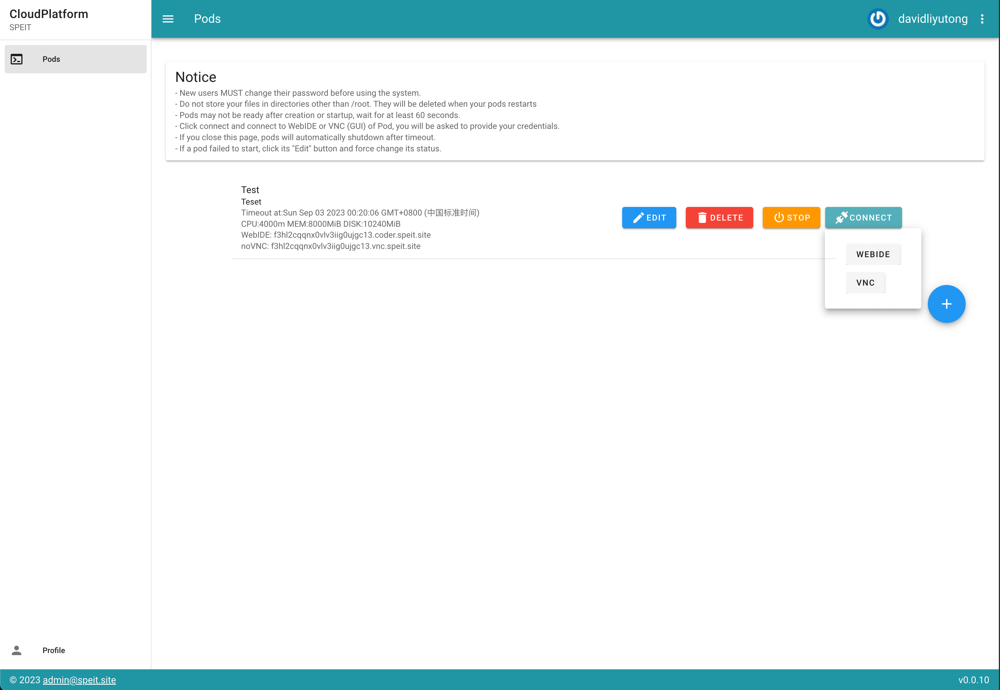

> WebIDE
>
> 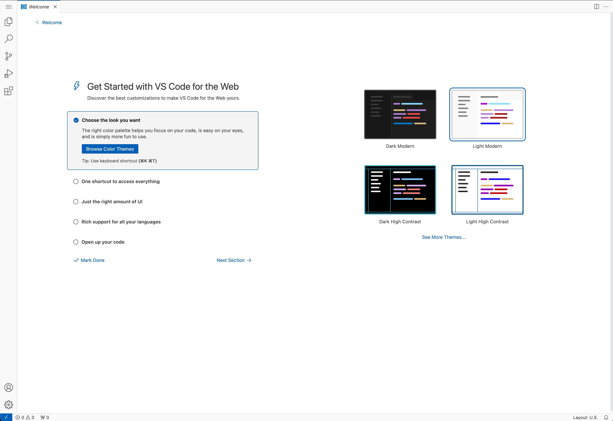

> VNC Virtual Desktop
>
> 

> Attention: If the 503 page appears, it is because the server needs to wait a minute to prepare the resource.
>
> 

> Attention: Make sure to save the file in the `/root` directory, otherwise it will be deleted after the pod shutdown. Storing files on the Desktop is fine.

#### Connecting to SSH

Currently, ssh access to pod is experimental. The connection is established via [websocat](https://github.com/vi/websocat).

To connect the pod via ssh, first install websocat on your local machine by following [the guide](https://github.com/vi/websocat#installation). Make sure command `websocat` is available in the shell.

```text
> websocat
websocat: No URL specified. Use `websocat --help` to show the help message.
```

Then, click the SSH button in CONNECT menu, the configuration will be copied to clipboard. Paste the configuration to the ssh config. See [this post](https://linuxize.com/post/using-the-ssh-config-file/) or Google to learn more about ssh config. Make sure something similar to this is in ssh config:

```text
Host <pod_id>
  HostName <pod_id>.ssh.example.com
  User root
  ProxyCommand websocat --binary wss://<pod_id>.ssh.example.com
```

> `<pod_id>` replaces pod_id of the pod

Before connecting the pod, ssh public key authentication must be configured in the pod. Connect to pod via WebIDE or VNC, and run the following commands:

```bash
mkdir -p ~/.ssh
chmod 600 ~/.ssh
```

Edit the `~/.ssh/authorized_keys` file and paste your public key. Save the file and exit. See [this post](https://linuxize.com/post/how-to-setup-passwordless-ssh-login/) or google to learn more about ssh public key authentication.

Now the pod can be connected via ssh:

```bash
ssh <pod_id>
```


### Pod Removal

Click the **DELETE** button to delete a pod. **All data stored in pod will be deleted.**

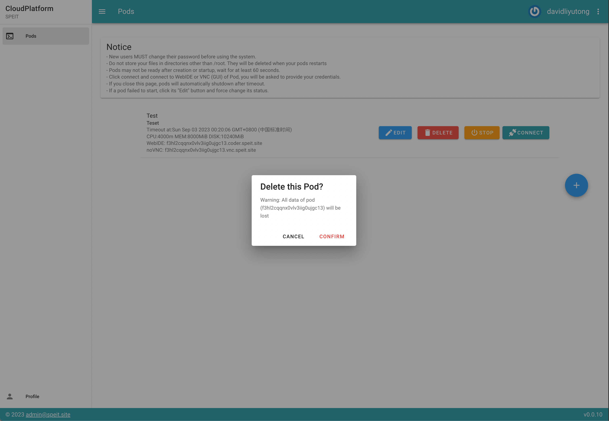

## Profile Management

Click the Profile button and navigate to profile management page.

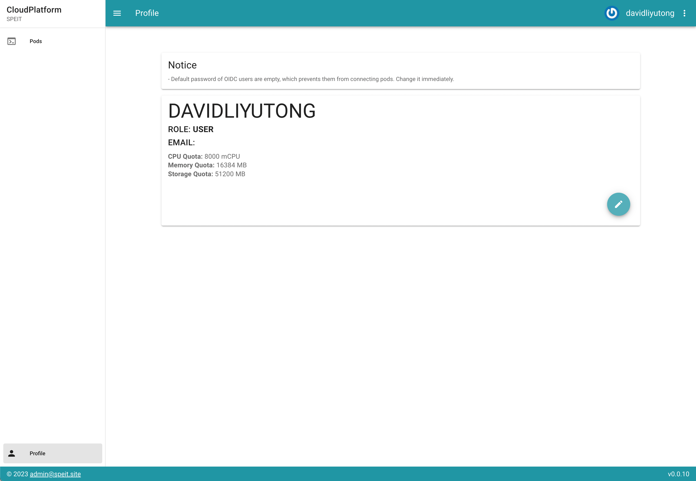

User can check their quota, modify their email and password.

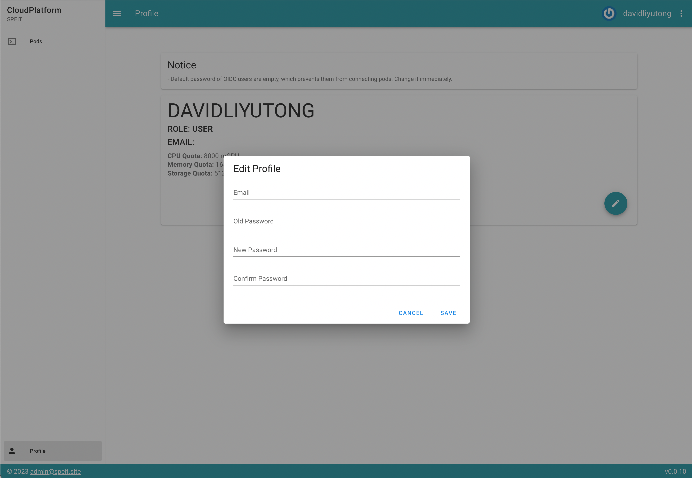

> Attention: OIDC users cannot change their password

> Attention: The email users configure will associate their avatars with [Gravatar](http://cn.gravatar.com/): they will be displayed along their usernames.
